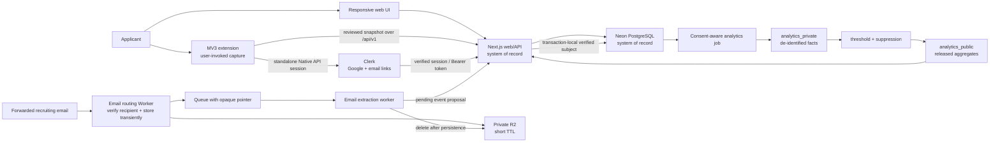

# Wip recommended architecture

Status: accepted through Milestone 2B
Last updated: 2026-08-05
Decision horizon: optimize Milestones 1–2; preserve clean boundaries for Milestones 3–4

## 1. Recommendation

Use a TypeScript monorepo with four explicit product boundaries, but deploy only what the current milestone needs:

1. **Web system of record:** Next.js App Router on Vercel, backed by Neon PostgreSQL, with Clerk authentication and server-established transaction identity enforcing PostgreSQL RLS.
2. **Extension capture layer:** Chrome Manifest V3 extension built with WXT, using a popup and user-invoked `activeTab` extraction.
3. **Inbound-email processing:** a separate Cloudflare Email Worker, private R2 transient storage, and queue consumer added in Milestone 3.
4. **Aggregate analytics:** isolated Postgres schemas and scheduled derivation jobs added in Milestone 4; move to a warehouse only when scale or query isolation justifies it.

Use pnpm workspaces for dependency management and Turborepo for dependency-aware tasks/cache. Keep shared domain contracts, validation, database access, API client, and UI primitives in packages once each boundary provides clear value. `packages/database` owns Drizzle schema, migrations, Neon clients, and seed logic; `packages/schemas` owns serialized command validation shared by web and extension; Clerk/server session integration, request-local command services, export/deletion orchestration, and the application-facing repository contract stay in `apps/web`. Milestones 2A/2B add and harden `apps/extension` but add no email, analytics, file, publication, or deployment scaffolding.

The recommendation favors a solo developer's delivery speed, managed free/low-cost starting tiers, portable PostgreSQL data, and the ability to split heavy workers later. Pricing changes frequently; verify current plan terms before provisioning rather than encoding numeric cost promises here.

## 2. System context



No browser client can read `analytics_private`, raw email storage, or service credentials. The extension and email worker never become alternate systems of record.

## 3. Proposed repository layout

```text
wip/
├── apps/
│   ├── web/                    # Milestone 1: Next.js responsive app and /api/v1
│   ├── extension/              # Milestone 2A: WXT/React Manifest V3 extension
│   └── email-ingest/           # Milestone 3: Cloudflare email + queue worker
├── packages/
│   ├── api-client/             # Later: typed HTTP client when a real API exists
│   ├── database/               # Drizzle schema, migrations, server DB factory, seed
│   ├── domain/                 # Event types, calculations, pure use-case logic
│   ├── fixtures/               # Fictional deterministic data shared by demo + DB seed
│   ├── schemas/                # Shared runtime validation and serialized contracts
│   ├── ui/                     # Accessible shared React primitives/tokens
│   ├── eslint-config/          # Shared lint configuration
│   └── typescript-config/      # Strict shared tsconfig bases
├── docs/
├── package.json
├── pnpm-lock.yaml
├── pnpm-workspace.yaml
└── turbo.json
```

Milestone 1B-3 added `packages/schemas`; Milestone 1C extended it with contacts/documents/export/deletion, and Milestone 2A adds the strict extension capture request/response contract. The extension's tiny fetch client remains beside the popup because it has only one consumer; authentication is not a cross-runtime shared package. The remaining shown directories describe later target boundaries, not required empty scaffolds. Do not add `apps/email-ingest` until Milestone 3. Aggregate derivation can begin as migrations/database functions plus scheduled jobs; add a separate `apps/analytics-worker` only if the work cannot safely fit a short idempotent database or server job.

## 4. Current options considered

The comparison below uses current official documentation as of the date above.

### Web framework and hosting

| Option | Advantages | Costs / risks | Decision |
| --- | --- | --- | --- |
| Next.js App Router on Vercel | One React/TypeScript app can provide responsive UI, server rendering, and versioned Route Handlers. Next.js documents typed `route.ts` handlers and supports Node, Docker, static, and adapter deployments, limiting hard lock-in. | App Router caching/runtime concepts add complexity; Vercel cost must be monitored as traffic and background work grow. | **Recommend.** Best solo-developer path for web UI plus extension-facing API. Keep portable SQL and standard HTTP boundaries. |
| React Router framework mode on Cloudflare Workers | Strong full-stack React/Vite workflow with direct Workers bindings and inexpensive edge deployment. Good if Cloudflare is chosen as the primary platform. | Workers runtime constraints and Cloudflare-specific bindings increase portability work; adopting it now provides little benefit for a CRUD-heavy tracker. | Viable alternative if the owner strongly prefers a Cloudflare-first stack. |
| Vite SPA plus a separate API | Very explicit client/server split and simple browser build. | Requires choosing, deploying, authenticating, and observing a second backend from day one; duplicates routing and validation work for a solo developer. | Do not choose for Milestone 1. |

Official references: [Next.js App Router](https://nextjs.org/docs/app), [Next.js Route Handlers](https://nextjs.org/docs/app/getting-started/route-handlers), [Next.js deployment options](https://nextjs.org/docs/app/getting-started/deploying), [React Router on Cloudflare Workers](https://developers.cloudflare.com/workers/framework-guides/web-apps/react-router/), and [Vercel Functions usage and pricing](https://vercel.com/docs/functions/usage-and-pricing).

### Database and authentication

| Option | Advantages | Costs / risks | Decision |
| --- | --- | --- | --- |
| Neon Postgres + Clerk | Serverless PostgreSQL, branching, auto-waking idle computes, managed Google/email authentication, and standard PostgreSQL RLS. | Two vendors must be configured consistently; the server must establish verified identity transactionally and the runtime role/password must remain separate from owner tooling. | **Selected by C-022, C-025, and C-046.** Use Drizzle and Neon's serverless driver server-side. Clerk authenticates; PostgreSQL authorizes rows. |
| Supabase Postgres + Auth | Full PostgreSQL with integrated passwordless/social auth and RLS-aware JWT integration. | Couples the database and auth platform; inactive free projects can require restoration behavior that the owner does not want for this project. | **Superseded.** Retained for decision history; do not add new Supabase dependencies or project structure. |
| SQLite/server-local database | Very cheap and simple locally. | Multi-device accounts, serverless deployment, concurrency, backups, RLS, and later worker access require an early migration. | Development fixture only, not the product database. |

Neon's serverless driver provides HTTP and WebSocket transports. Privileged migration/seed tooling keeps the existing HTTP/direct paths. Authenticated Wip operations use a request-local WebSocket pool because the existing repository and command services need one interactive transaction: Clerk first verifies the web cookie or extension session token, then the server sets a minimal `{ sub }` claim with transaction-local `set_config`, provisions/derives the owner, performs all reads/writes, commits or rolls back, and closes the pool. Neon's documented self-verification pattern requires a connection role without `BYPASSRLS`; Wip therefore uses the SQL-created `wip_runtime` role rather than the managed Data API `authenticated` role or `neondb_owner`. Runtime uses `NEON_RUNTIME_DATABASE_URL`; fictional seed tooling uses `DATABASE_URL`; drizzle-kit alone uses `DIRECT_DATABASE_URL`. Official references: [Neon serverless driver, self-verified JWT claims, and transactions](https://neon.com/docs/serverless/serverless-driver), [Neon RLS](https://neon.com/docs/guides/row-level-security), [Clerk Next.js auth](https://clerk.com/docs/reference/nextjs/app-router/auth), and [Drizzle with Neon](https://orm.drizzle.team/docs/get-started/neon-new).

### Monorepo tooling

| Option | Advantages | Costs / risks | Decision |
| --- | --- | --- | --- |
| pnpm workspaces + Turborepo | Strict workspace linking, one lockfile, fast installs, simple task graph/cache, and good TypeScript monorepo conventions. | Two tools instead of one; task outputs and environment inputs must be configured accurately. | **Recommend.** Use Turbo only for orchestration/cache, not application architecture. |
| npm workspaces only | Lowest tooling count and native workspace support. | Less strict workspace behavior and no dependency-aware task cache/orchestration without additional scripting. | Acceptable simplification if pnpm is unwanted. |
| Nx | Rich generators, boundaries, affected commands, and plugins. | More conventions and maintenance than this small solo repository needs initially. | Revisit only if the repository becomes much larger. |

Official references: [pnpm workspaces](https://pnpm.io/workspaces), [Turborepo caching](https://turborepo.com/docs/crafting-your-repository/caching), and [npm workspaces](https://docs.npmjs.com/cli/using-npm/workspaces/).

### Extension build approach

| Option | Advantages | Costs / risks | Decision |
| --- | --- | --- | --- |
| WXT + React popup | Generates extension entrypoints/manifests, supports MV3 and TypeScript, provides development/reload tooling, and still uses standard Chrome APIs. | Adds a framework abstraction and multi-browser features that Wip may not immediately use. | **Selected for Milestone 2A.** Extraction stays a serializable framework-independent function with checked-in fictional fixtures. |
| Plain MV3 + Vite | Smallest dependency surface and closest to Chrome documentation. | More custom build, manifest-per-environment, asset, reload, and test wiring for one developer. | Good fallback if WXT proves limiting. |

WXT describes itself as an open-source web-extension framework and explicitly leaves extension API behavior to the platform. Chrome requires MV3 service workers and forbids remotely hosted executable code. Official references: [WXT introduction](https://wxt.dev/guide/introduction.html), [Chrome Manifest V3](https://developer.chrome.com/docs/extensions/develop/migrate/what-is-mv3), and [Chrome Scripting API](https://developer.chrome.com/docs/extensions/reference/api/scripting).

### Inbound email

| Option | Advantages | Costs / risks | Decision |
| --- | --- | --- | --- |
| Cloudflare Email Routing → Worker → private R2 + Queue | Receives the raw message directly in a dedicated worker, permits explicit short-lived object storage, lifecycle deletion, queue retries, and tight separation from the web app. | Adds a second cloud platform, MIME parsing, queue/storage operations, and a separate deployment. Raw messages larger than queue limits require an object pointer. | **Provisional recommendation for Milestone 3** because retention is controllable and the boundary is clean. Prototype and privacy-review before committing. |
| Resend Inbound webhook | Easiest Next.js integration, parsed message APIs, signatures, retries, and replay support. | Official docs state that Resend stores received mail; current public docs reviewed here do not establish the per-message deletion control Wip needs. | Do not select until retention/deletion is contractually and technically compatible with `docs/privacy.md`. |
| Direct Gmail/Outlook API | No forwarding habit for the user and access to threads. | Broad inbox authorization, complex provider verification, token storage, and far greater privacy surface. | Explicitly postponed; not in the scoped roadmap. |

Official references: [Cloudflare Email Routing](https://developers.cloudflare.com/email-service/configuration/email-routing-addresses/), [Email Worker handler](https://developers.cloudflare.com/email-service/api/route-emails/email-handler/), [Cloudflare Queues](https://developers.cloudflare.com/queues/), [R2 object lifecycles](https://developers.cloudflare.com/r2/buckets/object-lifecycles/), [R2 data security](https://developers.cloudflare.com/r2/reference/data-security/), [Resend receiving](https://resend.com/docs/dashboard/receiving/introduction), and [Resend webhook delivery semantics](https://resend.com/docs/webhooks/introduction).

## 5. Web system of record

### Responsibilities

At production maturity, `apps/web` owns:

- authentication UI and session handling;
- responsive screens;
- `/api/v1` HTTP endpoints consumed by the extension and future workers;
- authorization-aware command handlers;
- event validation, confirmation, and projection updates;
- export/deletion orchestration; and
- read models for Today, table/Kanban, and application detail.

Milestone 1A implemented the responsive screens and read-oriented application boundary over fictional seed data. Milestone 1B-1 added the server-only Neon repository. Milestone 1B-2 added Clerk authentication, internal owner provisioning, and read RLS. Milestone 1B-3 added manual tracker mutations, a versioned HTTP boundary, narrow write RLS, and permanent single-application deletion. Milestone 1C added Kanban through the same stage command, contacts, metadata-only document versions/uses, direct versioned export, and transactionally deleting all tracker data. Milestone 2A added authenticated extension capture. Milestone 2B adds strict Clerk authorized-party validation, stable development identity, conservative duplicate serialization, explicit immutable snapshot attachment, isolated ATS adapters, and store-ready local packaging while reusing the same request-local command/RLS path. Archive/restore, deployment, and Clerk-account deletion remain postponed. The data source is selected explicitly; demo data may be used only through deliberate demo configuration and never silently in production.

Use Next.js Route Handlers for the stable external API because Server Actions are coupled to the web build and are not the right contract for an extension or worker. Web server components may call the same domain/application services directly, but there must be one implementation of each command rule.

### API shape

Use JSON over HTTPS under `/api/v1`. Share runtime schemas and inferred TypeScript types, not database row types. Initial resource/command surface:

```text
GET    /api/v1/applications
POST   /api/v1/applications
GET    /api/v1/applications/:applicationId
PATCH  /api/v1/applications/:applicationId
DELETE /api/v1/applications/:applicationId
POST   /api/v1/applications/:applicationId/events
POST   /api/v1/applications/:applicationId/notes
PATCH  /api/v1/applications/:applicationId/notes/:noteId
DELETE /api/v1/applications/:applicationId/notes/:noteId
POST   /api/v1/applications/:applicationId/actions
PATCH  /api/v1/applications/:applicationId/actions/:actionId
DELETE /api/v1/applications/:applicationId/actions/:actionId
POST   /api/v1/applications/:applicationId/contacts
PATCH  /api/v1/applications/:applicationId/contacts/:associationId
DELETE /api/v1/applications/:applicationId/contacts/:associationId
POST   /api/v1/applications/:applicationId/documents
PATCH  /api/v1/applications/:applicationId/documents/:documentId
DELETE /api/v1/applications/:applicationId/document-uses/:useId
POST   /api/v1/captures
POST   /api/v1/captures/snapshots
GET    /api/v1/tracker/export?format=json|csv
DELETE /api/v1/tracker
```

This is the implemented surface through Milestone 2B. Contact and document commands retain the Milestone 1C behavior. `POST /api/v1/captures` accepts one reviewed extension capture, creates a new application/confirmed initial event/immutable snapshot through the existing command service, or returns a typed owner-scoped duplicate without writing. `POST /api/v1/captures/snapshots` appends one reviewed immutable snapshot plus a confirmed `job_description.snapshot_attached` event to the explicitly selected owner-scoped application. It never rewrites prior snapshots. General recapture UI, event proposal confirmation/rejection, create-anyway duplicate override, and Clerk-account deletion remain later additions. Application creation may include one optional manually pasted snapshot. Create, stage-event, capture, and attachment requests require an `Idempotency-Key`; other mutations use explicit row versions where stale overwrites are possible. Do not expose arbitrary event payload writes; accept a discriminated, validated command schema per event type.

Exports stream directly from an owner-scoped read service: JSON uses the versioned `wip.tracker.export` envelope and CSV contains the applications projection with spreadsheet-formula prefixes neutralized. Wip does not persist export artifacts. Whole-tracker deletion requires the exact phrase `DELETE MY WIP DATA` and calls a zero-argument `SECURITY DEFINER` database function. The function derives the current owner from the transaction-local verified subject, deletes applications/documents/contacts in the same database transaction, resets tracker preferences, and retains only the owner-to-Clerk mapping so the independent authentication account remains usable.

Unsafe cookie-authenticated web requests require an exact matching `Origin`, reject non-`same-origin` Fetch Metadata when present, and accept JSON only where a body is expected. Extension capture and attachment instead require a syntactically valid Bearer header, Clerk's verified normal `session_token`, an exact `chrome-extension://` origin from `WIP_EXTENSION_ORIGINS`, a matching Clerk authorized-party (`azp`) claim, and reflected non-wildcard CORS/preflight headers. The same parsed list configures Clerk middleware and the extension route. The server bounds the streamed JSON body, validates strict Zod command schemas, derives identity only from Clerk, and returns stable `{ error: { code, message, fields? } }` bodies. Routes are thin adapters; reusable command services own persistence rules.

### Domain and persistence rules

- Put event taxonomy, stage reduction, confirmation policy, due/stale calculations, and aggregate eligibility into pure functions in `packages/domain`.
- Put serializable input/output schemas in `packages/schemas` using a runtime validator such as Zod.
- Define the PostgreSQL model in `packages/database` with Drizzle's TypeScript schema and generate reviewable SQL migrations with drizzle-kit. Check both the schema and generated SQL into source control. Production changes run `drizzle-kit migrate`; automatic schema pushing is not a production strategy.
- Perform each authenticated repository/command operation atomically inside its identity-establishing Neon transaction. Preserve user-supplied `occurred_at` separately from database `created_at`.
- Every user-owned table has a non-null `owner_id`; composite keys prevent cross-owner relationships and repository predicates provide defense in depth. All 11 owner/identity tables enable and force RLS. The ten owned-table policies compare `owner_id` with the internal UUID returned by `wip_current_owner_id()`; the `owners` policy compares its Clerk subject with `wip_clerk_subject()` from the current transaction only.
- Authenticated web requests never accept `owner_id` or auth subject as caller input. Clerk supplies the verified subject to the server-only request context. `wip_runtime` is SQL-created, password-protected, non-elevated, and `NOBYPASSRLS`; it receives SELECT, the zero-argument functions, and operation/column grants only for implemented commands. Immutable events and snapshots receive INSERT but no UPDATE/DELETE grant; immutable document versions receive INSERT but no UPDATE/DELETE grant.
- `DATABASE_URL`, `DIRECT_DATABASE_URL`, `CLERK_SECRET_KEY`, and privileged database access are server-only. `DATABASE_URL` is seed-only, `DIRECT_DATABASE_URL` is migration-only, and neither is normal web runtime configuration. No database URL or secret can use a `NEXT_PUBLIC_` prefix, enter a browser bundle, or be sent to the extension.
- Identity is set only after Clerk verification and with PostgreSQL's transaction-local flag. The connection is request-local and closed before returning, so claims cannot survive commit/rollback or cross users. Missing or invalid Clerk authentication fails closed before a runtime transaction opens.
- Application and editable child versions provide stale-write detection. Create/stage idempotency keys are owner-unique, and the stage projector orders confirmed events by effective time, server creation time, and stable event ID.

## 6. Extension capture layer

### Flow

1. The user clicks the Wip extension action on a job page.
2. `activeTab` grants temporary access; the service worker uses `chrome.scripting.executeScript` in the main frame.
3. The extractor finds likely job-description content using semantic elements, JSON-LD `JobPosting`, and bounded generic heuristics. Site-specific adapters are optional and isolated.
4. The popup shows title, company, location, source URL, and captured description with warnings for missing/ambiguous fields.
5. The user edits company, role, location, canonical stage, and optional metadata, then explicitly saves.
6. The extension sends the reviewed capture to the exact Wip API origin with an on-demand Clerk session token and idempotency key. The server verifies, validates, and sanitizes again, hashes normalized text, and inserts the application, confirmed extension event, and immutable snapshot inside one identity-establishing Neon transaction.
7. Before duplicate checks and creation, the database transaction takes deterministic owner/key advisory locks for the reviewed URLs and requisition/company key. Concurrent identical captures therefore serialize, and a retry/loser returns the existing application instead of racing to create a second one.
8. A conservative existing URL or requisition/company match returns a typed duplicate. The user may open it unchanged or explicitly attach the reviewed description; attachment appends a new immutable snapshot and confirmed event, and never changes earlier history.
9. The extension clears transient page content from `chrome.storage.session` after success or explicit cancel. A recoverable error—including expired/revoked authentication—preserves the reviewed draft for reauthentication and retry.

Do not use a persistent content script across all pages, monitor navigation, scrape results pages in bulk, or access browser cookies. Extraction failure should allow manual selection/paste rather than escalating permission scope.

### Anticipated Chrome permissions

| Permission / manifest field | 2B status | Why it is needed | Constraint |
| --- | --- | --- | --- |
| `activeTab` | Required M2 | Temporarily read the current page after the user invokes Wip. Chrome documents it as an alternative to persistent `<all_urls>` access. | Access lasts only for the invoked tab/origin and ends on navigation/close. |
| `scripting` | Required M2 | Run the packaged extractor in the active tab. | Execute only after a user gesture; main frame by default. |
| `storage` | Required M2 | Keep settings, short-lived auth/session state, and an unsent capture draft. | Do not use as a second tracker or permanent job-description archive; clear page content promptly. |
| Exact `host_permissions` for `WXT_WIP_API_ORIGIN` | Required | Allow the popup to call the system-of-record capture API. | One configured `http(s)` origin plus `/*`; no wildcard host or unrelated app host. |
| Exact `host_permissions` for `WXT_CLERK_FRONTEND_API_ORIGIN` | Required | Allow Clerk's supported extension SDK to create/refresh the standalone Native API session. | One configured Clerk Frontend API origin plus `/*`; the Clerk secret key is never present. |
| `notifications` / `alarms` | Optional later | Deliver opt-in local reminders if that channel is selected. | Request at runtime when enabling the feature, not at install. |
| `contextMenus` | Optional later | Add a user-invoked “Save job to Wip” context action. | Add only if user research supports it. |

Do not request `tabs`, `identity`, `history`, `cookies`, `webRequest`, `declarativeNetRequest`, `downloads`, `unlimitedStorage`, broad `content_scripts.matches`, or `<all_urls>` for 2B. `activeTab` already permits the needed tab URL/title and temporary script access. Source, manifest, built-artifact, and release-ZIP checks fail if this boundary broadens. References: [activeTab](https://developer.chrome.com/docs/extensions/develop/concepts/activeTab), [Scripting API permissions](https://developer.chrome.com/docs/extensions/reference/api/scripting), [Storage API](https://developer.chrome.com/docs/extensions/reference/api/storage), and [declaring/optional permissions](https://developer.chrome.com/docs/extensions/develop/concepts/declare-permissions).

### Authentication

Clerk is the web identity provider. Initial methods are Google and passwordless email verification links, rendered with Clerk's prebuilt Next.js components. Next.js 16 uses `proxy.ts` with `clerkMiddleware()` to expose verified session state; each protected page and data function still checks authentication next to the resource with `auth()`/`auth.protect()`. The public root renders an intentional signed-out landing instead of tracker data.

Clerk's immutable `sub` is stored once on the provider-neutral internal owner. First authenticated access calls `wip_provision_owner()` with no arguments inside the identity-establishing transaction; the security-definer function reads only `wip_clerk_subject()` and returns the existing/new internal UUID. A unique Clerk-subject index makes retries and concurrent first requests idempotent. New owners remain empty, and the seed owner has no auth subject.

Milestone 2B uses `@clerk/chrome-extension` in standalone popup mode (`standardBrowser={false}`). Clerk's current matrix supports email OTP/password/passkey in this mode but not OAuth or email-link redirects. Wip therefore requires the developer to enable Clerk Native API and email verification code; Google/email-link sign-in remains available on the web. The popup calls `getToken({ skipCache: true })` only when the user confirms Save/Attach and sends the normal Clerk session token as `Authorization: Bearer`; Wip code never writes or logs that JWT. The capture Route Handler verifies it with `auth({ acceptsToken: 'session_token' })`, requires the token `azp` to match the exact extension request origin and server allowlist, and passes only the resulting subject into the server-side transaction boundary. The caller never sees database claims, credentials, or URLs. An authentication rejection signs the popup out but preserves the session-only reviewed draft.

Clerk's Sync Host would share web authentication, but its documented manifest requires `cookies`. That conflicts with C-040, so Sync Host is not configured and opening web sign-in does not silently synchronize the extension session. A checked-in public manifest key makes the unpacked development ID stable without storing private signing material; the Web Store production identity must be recorded and allowlisted before submission. Before external beta, complete vendor review of the SDK's internal session-at-rest behavior and Native API abuse controls. References: [Clerk Chrome Extension SDK](https://clerk.com/docs/reference/chrome-extension/overview), [Native API setup](https://clerk.com/docs/guides/development/deployment/chrome-extension), [Sync Host](https://clerk.com/docs/guides/sessions/sync-host), [Clerk-authenticated Next.js Route Handlers](https://clerk.com/docs/reference/nextjs/app-router/route-handlers), and [Chrome manifest key](https://developer.chrome.com/docs/extensions/reference/manifest/key).

## 7. Inbound-email processing

Add this boundary only in Milestone 3.

### Proposed flow

1. Give each user an opaque, rotatable forwarding alias such as `<random-token>@in.example.com`; store only a hash of the token in the web database.
2. Cloudflare Email Routing invokes `apps/email-ingest`. The worker accepts only valid recipient aliases and basic message limits.
3. Write the raw RFC 822 message to a private, non-public R2 key with encryption at rest and a maximum seven-day lifecycle backstop. The normal successful path deletes much sooner.
4. Enqueue an opaque message ID and object key—not raw content. Queue retries and a dead-letter path handle transient failures.
5. The consumer retrieves/parses the object, matches it to a user/application, and invokes the approved structured extraction provider with minimal content and no-training/retention controls.
6. The consumer calls a worker-authenticated narrow web endpoint that persists extraction metadata and one or more pending events.
7. After database acknowledgement, delete the raw object. Record deletion time without retaining content.
8. The user confirms, rejects, or corrects each status-changing proposal in the web app. Confidence influences ordering/explanation only.

Webhook/worker operations must be idempotent and order-independent. The web system—not the email worker—owns application matching decisions that mutate state and the event-confirmation workflow.

Attachments should be ignored in the first email-ingestion slice unless a supported recruiting event cannot be extracted without them. Never treat attached resumes as permission to add document content to Wip.

## 8. Aggregate analytics

Start inside PostgreSQL with schema-level isolation:

- `public` or `app`: operational user data with RLS;
- `analytics_private`: restricted de-identified contribution facts, no client grants; and
- `analytics_public`: thresholded, versioned aggregate cells readable through the web API.

A scheduled idempotent job reads only confirmed, consent-eligible event projections, derives bounded intervals/outcomes, removes direct identifiers/free text/exact times, and writes private facts. A second job groups facts and applies cohort/denominator/complementary suppression before releasing rows. The Milestone 4 scheduler/queue is deliberately unselected; evaluate Neon scheduled-function options, Vercel Cron, or an isolated worker only when the aggregate design is approved.

Keep metric definitions versioned. Initial candidates:

- time from confirmed submission to first non-automated employer response;
- interview-invite rate among submitted applications;
- rejection rate among applications with an observed terminal outcome or a disclosed window;
- offer rate among submitted applications;
- offer-acceptance rate among observed offers; and
- no-response/ghosting only after its observation window and caveats are approved.

PostgreSQL is adequate for early batch aggregates. Move private facts to a dedicated warehouse only when volume, query latency, access isolation, or privacy tooling demands it. The product should never use client-side analytics tools as the source of Hiring Pulse facts.

## 9. Environments, deployment, and cost control

### Milestone 1A

- Local: current Node LTS, pnpm, `apps/web`, `packages/domain`, and deterministic fictional seed data.
- No authentication provider, database, persistence, or production deployment was created in 1A.
- The prototype remains compatible with the planned Vercel deployment model through a successful Next.js production build.

### Milestone 1B-1

- Add one Neon development branch/database, Drizzle schema, checked-in SQL migrations, an idempotent fictional seed, and a Neon-backed read repository.
- During 1B-1, `DATABASE_URL` served the fictional pooled read/seed path and `DIRECT_DATABASE_URL` served migrations. C-046 supersedes normal runtime use of `DATABASE_URL` with the password-protected, least-privilege `NEON_RUNTIME_DATABASE_URL`. Use a separate disposable Neon branch for integration tests.
- Keep the in-memory demo source available only through explicit configuration. In production mode it must fail closed unless a deliberate build/demo override is supplied; missing database credentials must not silently select demo data.
- Do not deploy, configure authentication, expose mutations, or invite real-user data during this slice.

### Milestone 1B-2

- Add Clerk with Google and email-link authentication, map verified subjects idempotently to internal owners, create the least-privilege `wip_runtime` database role, and enforce/test PostgreSQL RLS.
- Use `NEON_RUNTIME_DATABASE_URL` only for request-time authenticated operations. Keep `DATABASE_URL` limited to seed tooling and `DIRECT_DATABASE_URL` limited to migrations.
- Preserve the explicit local/test demo and read-only product. Do not add mutations, `/api/v1`, deployment, or real-user beta data in this slice.

### Milestone 1B-3

- Add the implemented `/api/v1` application, event, note, and next-action routes; transactionally safe create/stage commands; optional manual semantic snapshot; permanent confirmed application deletion; and narrow write policies/grants.
- Keep the explicit demo read-only. Do not use `DATABASE_URL` or `DIRECT_DATABASE_URL` for real-user mutations.
- Postpone export, archive/restore, Kanban, snapshot recapture, document/contact management, and environment/deployment work to separately authorized slices.

### Milestone 1C

- Add a Table/Board switch over one repository result. The table remains default; the board uses native drag-and-drop plus a labeled per-card selector and the existing transactional stage-event command.
- Add owner-scoped contact/association and logical-document/version/use commands. Keep document versions append-only and document contents out of the database.
- Generate versioned JSON and applications CSV directly from owner-scoped reads without creating stored export objects.
- Delete all tracker data through a zero-argument owner-derived database function after exact-phrase confirmation; keep Clerk-account deletion separate.
- Extend forced RLS, cross-owner constraints, and narrow grants only for this surface. Keep demo mode read-only.
- Continue to postpone archive/restore, snapshot recapture, deployment, extension, email, Hiring Pulse, uploads, billing, and production beta admission.

### Milestone 2A

- Add `apps/extension`, shared capture schemas, `POST /api/v1/captures`, and a development-only fictional capture page.
- Keep page access user-invoked/current-tab-only and temporary; keep all persistent writes in the web/Neon system of record.
- Configure the unpacked extension ID explicitly in Clerk allowed origins and `WIP_EXTENSION_ORIGINS`; do not wildcard CORS.
- Build an unpacked and ZIP artifact locally and scan the built files/manifest for secret/database markers and broad permissions.
- Continue to postpone Web Store publication, stable production CRX identity, deployment, broad ATS adapters, duplicate override/snapshot attachment, background detection, email, Hiring Pulse, uploads, and production beta admission.

### Milestone 2B

- Stabilize unpacked development identity with a public manifest key; validate exact extension parties in Clerk middleware, extension APIs, and CORS.
- Serialize conservative duplicate keys transactionally and add an explicit idempotent append-only snapshot-attachment command.
- Add narrow fixture-backed Greenhouse, Lever, and Workday adapters while retaining JSON-LD precedence and generic fallback.
- Add complete PNG icons, restrictive MV3 CSP, release ZIP generation, bundle/ZIP secret and content inspection, permission/privacy disclosures, and a store-listing draft.
- Keep publishing/signing, deployment, create-anyway duplicate override, broad site support, background browsing, Sync Host/cookies, email, Hiring Pulse, uploads, and production beta admission postponed.

### Later

- Add isolated preview/production environments and any Clerk-account deletion workflow only in an explicitly scoped milestone.
- Production initially remains one Vercel web deployment and one Neon project/database, with separate branches or projects where isolation requires them. Set spend alerts and review function/database/storage usage monthly.

- Milestone 2B prepares stable development identity and store-ready packaging; publishing/signing still requires explicit authorization.
- Milestone 3 adds one Cloudflare worker, one private R2 bucket with lifecycle rules, and one queue/dead-letter queue.
- Milestone 4 adds scheduled analytics jobs and restricted schemas, not a warehouse by default.

Do not share production credentials with previews. Use separate least-privilege credentials per deployable and rotate them. Keep environment validation typed and fail startup/build when required secrets are missing.

## 10. Testing and observability

Expected toolchain: strict TypeScript, ESLint, Prettier, Vitest, React Testing Library, Playwright, database/RLS tests, and extension integration tests using a controlled fixture page.

Minimum critical tests:

- event-to-stage reduction, backdated events, correction, and confirmation gating;
- snapshot immutability and sanitization;
- cross-user reads/writes and cross-owner joins;
- Today urgency and timezone boundaries;
- application CRUD/export/deletion cascades;
- current-tab-only extension capture and manifest permission snapshot;
- email idempotency, raw-object deletion, confidence display, and no silent projection update; and
- aggregate consent, withdrawal, threshold suppression, and lack of identifiers.

Use structured logs with request/correlation ID, route/operation, deployment version, latency, and error code. Redact bodies, URLs with query strings, names, email addresses, snapshot text, notes, tokens, and event payloads. Error monitoring must receive sanitized exceptions only.

## 11. Architecture gates

Before Milestone 1A implementation (resolved 2026-08-04):

- use the confirmed Next.js/Vercel web stack;
- use the confirmed semantic snapshot and stage vocabulary, including `assessment`;
- use fictional seed data behind a replaceable boundary;
- exclude authentication and backend integration; and
- postpone Kanban until the end of Milestone 1.

Milestone 1B-1 gate (resolved 2026-08-04):

- use Neon PostgreSQL, Drizzle ORM/drizzle-kit, checked-in SQL migrations, pooled runtime and direct migration URLs;
- implement only the read repository, normalized schema, idempotent seed, and integration-test foundation;
- retain the explicit in-memory source for test/local demo use without a silent production fallback; and
- retain metadata-only document handling through the initial beta.

Milestone 1B-2 gate (resolved 2026-08-04):

- use Clerk with Google and passwordless email links;
- verify Clerk sessions in Next.js and establish their verified subject only inside the database transaction, as amended by C-046;
- map verified Clerk subjects to unique internal owner UUIDs through a zero-argument idempotent database function;
- enable and force RLS for every owner/identity table; use a password-protected, `NOBYPASSRLS`, least-privilege runtime role; and
- keep the product read-only and the demo source explicit.

Milestone 1B-3 gate (resolved 2026-08-05):

- run commands inside request-local Neon transactions that establish server-verified identity before every real-user read/write, as amended by C-046;
- expose only the versioned application, manual-stage, note, next-action, and confirmed deletion commands in this slice;
- require same-origin JSON mutation requests, bounded strict schemas, stable errors, create/event idempotency, and row versions for stale-write protection;
- add narrow write RLS and grants without permitting event or snapshot updates/deletes; and
- keep demo mode explicitly read-only while postponing export, archive/restore, Kanban, recapture, documents/contacts, deployment, and later product systems.

Milestone 1C gate (resolved 2026-08-05):

- keep table and board as two views of the same query and persist stage changes only by appending immutable events through the existing command;
- preserve a non-drag keyboard alternative and confine mobile board overflow to the board region;
- model contacts and document metadata through owner-scoped associations, append-only document versions, forced RLS, and narrow grants;
- export owner-scoped data without server-side export retention, and distinguish transactionally deleting tracker data from deleting the Clerk identity; and
- retain explicit read-only demo behavior while excluding archive/restore, recapture, deployment, extension, email, Hiring Pulse, uploads, billing, and real-user beta admission.

Milestone 2A gate (resolved 2026-08-05):

- use Clerk's standalone Chrome Extension SDK/Native API flow with on-demand session tokens; do not request `cookies` for Sync Host;
- allow only the exact configured Wip API and Clerk Frontend API hosts alongside `activeTab`, `scripting`, and session-backed `storage`;
- accept extension capture through a bounded, authenticated, exact-origin CORS endpoint that derives the owner server-side; and
- sanitize semantic HTML, normalize URLs, and compute the authoritative content hash on the server before an atomic create/event/snapshot write.

Before Milestone 3:

- verify email provider retention/deletion and model-provider data controls;
- approve raw-email retry window and attachment handling;
- document alias abuse controls, rate limits, and incident response; and
- complete a privacy/security review.

Before Milestone 4:

- approve metric definitions, cohort dimensions, minimum thresholds, and contribution disclosure;
- test withdrawal/deletion recomputation; and
- review re-identification and selection-bias language.
