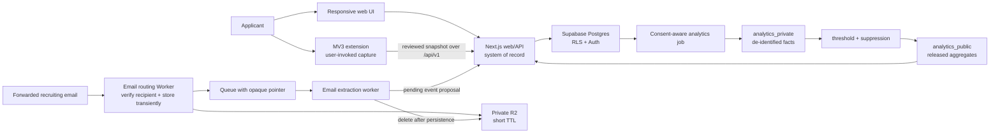

# WIP recommended architecture

Status: proposed Milestone 0 architecture  
Last updated: 2026-08-04  
Decision horizon: optimize Milestones 1–2; preserve clean boundaries for Milestones 3–4

## 1. Recommendation

Use a TypeScript monorepo with four explicit product boundaries, but deploy only what the current milestone needs:

1. **Web system of record:** Next.js App Router on Vercel, backed by Supabase Postgres and Supabase Auth.
2. **Extension capture layer:** Chrome Manifest V3 extension built with WXT, using a popup and user-invoked `activeTab` extraction.
3. **Inbound-email processing:** a separate Cloudflare Email Worker, private R2 transient storage, and queue consumer added in Milestone 3.
4. **Aggregate analytics:** isolated Postgres schemas and scheduled derivation jobs added in Milestone 4; move to a warehouse only when scale or query isolation justifies it.

Use pnpm workspaces for dependency management and Turborepo for dependency-aware tasks/cache. Keep shared domain contracts, validation, API client, and UI primitives in packages. Do not create extension, email, or analytics deployment scaffolding during Milestone 1 unless a shared package genuinely needs its contract.

The recommendation favors a solo developer's delivery speed, managed free/low-cost starting tiers, portable PostgreSQL data, and the ability to split heavy workers later. Pricing changes frequently; verify current plan terms before provisioning rather than encoding numeric cost promises here.

## 2. System context



No browser client can read `analytics_private`, raw email storage, or service credentials. The extension and email worker never become alternate systems of record.

## 3. Proposed repository layout

```text
wip/
├── apps/
│   ├── web/                    # Milestone 1: Next.js responsive app and /api/v1
│   ├── extension/              # Milestone 2: WXT Manifest V3 extension
│   └── email-ingest/           # Milestone 3: Cloudflare email + queue worker
├── packages/
│   ├── api-client/             # Typed, versioned HTTP client used by web/extension/workers
│   ├── domain/                 # Event types, reducers, policies, pure use-case logic
│   ├── schemas/                # Shared runtime validation and serialized contracts
│   ├── ui/                     # Accessible shared React primitives/tokens
│   ├── eslint-config/          # Shared lint configuration
│   └── typescript-config/      # Strict shared tsconfig bases
├── supabase/
│   ├── migrations/             # SQL schema, RLS, functions, projections
│   ├── seed.sql                # Fictional development/test seed data only
│   └── tests/                  # Database/RLS tests
├── docs/
├── package.json
├── pnpm-lock.yaml
├── pnpm-workspace.yaml
└── turbo.json
```

Do not add `apps/email-ingest` until Milestone 3. Aggregate derivation can begin as migrations/database functions plus scheduled jobs; add a separate `apps/analytics-worker` only if the work cannot safely fit a short idempotent database or server job.

## 4. Current options considered

The comparison below uses current official documentation as of the date above.

### Web framework and hosting

| Option | Advantages | Costs / risks | Decision |
| --- | --- | --- | --- |
| Next.js App Router on Vercel | One React/TypeScript app can provide responsive UI, server rendering, and versioned Route Handlers. Next.js documents typed `route.ts` handlers and supports Node, Docker, static, and adapter deployments, limiting hard lock-in. | App Router caching/runtime concepts add complexity; Vercel cost must be monitored as traffic and background work grow. | **Recommend.** Best solo-developer path for web UI plus extension-facing API. Keep portable SQL and standard HTTP boundaries. |
| React Router framework mode on Cloudflare Workers | Strong full-stack React/Vite workflow with direct Workers bindings and inexpensive edge deployment. Good if Cloudflare is chosen as the primary platform. | Workers runtime constraints and Cloudflare-specific bindings increase portability work; adopting it now provides little benefit for a CRUD-heavy tracker. | Viable alternative if the owner strongly prefers a Cloudflare-first stack. |
| Vite SPA plus a separate API | Very explicit client/server split and simple browser build. | Requires choosing, deploying, authenticating, and observing a second backend from day one; duplicates routing and validation work for a solo developer. | Do not choose for Milestone 1. |

Official references: [Next.js App Router](https://nextjs.org/docs/app), [Next.js Route Handlers](https://nextjs.org/docs/app/getting-started/route-handlers), [Next.js deployment options](https://nextjs.org/docs/app/getting-started/deploying), [React Router on Cloudflare Workers](https://developers.cloudflare.com/workers/framework-guides/web-apps/react-router/), and [Vercel Functions usage and pricing](https://vercel.com/docs/functions/usage-and-pricing).

### Database and authentication

| Option | Advantages | Costs / risks | Decision |
| --- | --- | --- | --- |
| Supabase Postgres + Auth | Full PostgreSQL, integrated passwordless/social auth, local CLI workflow, and row-level security that can enforce per-user ownership at the data layer. | Multiple Supabase features can tempt direct client access and service-role overuse; RLS and grants must be tested explicitly. | **Recommend.** Use Postgres as the durable asset and preserve user JWT context through normal requests. |
| Neon Postgres + separate auth | Excellent serverless Postgres behavior, branching, pooling, and provider separation. | A separate auth vendor and authorization integration add accounts, billing surfaces, and failure modes during the solo-developer stage. | Strong fallback if Supabase Auth or platform terms become unsuitable. |
| SQLite/server-local database | Very cheap and simple locally. | Multi-device accounts, serverless deployment, concurrency, backups, RLS, and later worker access require an early migration. | Development fixture only, not the product database. |

Supabase provides a full Postgres database, and its documentation requires RLS on exposed tables; Auth issues JWTs that integrate with RLS. Neon is a portable alternative with autoscaling and branching. Official references: [Supabase database](https://supabase.com/docs/guides/database/overview), [Supabase Auth](https://supabase.com/docs/guides/auth), [Supabase RLS](https://supabase.com/docs/guides/database/postgres/row-level-security), [securing the Supabase Data API](https://supabase.com/docs/guides/api/securing-your-api), and [Neon overview](https://neon.com/docs/introduction).

### Monorepo tooling

| Option | Advantages | Costs / risks | Decision |
| --- | --- | --- | --- |
| pnpm workspaces + Turborepo | Strict workspace linking, one lockfile, fast installs, simple task graph/cache, and good TypeScript monorepo conventions. | Two tools instead of one; task outputs and environment inputs must be configured accurately. | **Recommend.** Use Turbo only for orchestration/cache, not application architecture. |
| npm workspaces only | Lowest tooling count and native workspace support. | Less strict workspace behavior and no dependency-aware task cache/orchestration without additional scripting. | Acceptable simplification if pnpm is unwanted. |
| Nx | Rich generators, boundaries, affected commands, and plugins. | More conventions and maintenance than this small solo repository needs initially. | Revisit only if the repository becomes much larger. |

Official references: [pnpm workspaces](https://pnpm.io/workspaces), [Turborepo caching](https://turborepo.com/docs/crafting-your-repository/caching), and [npm workspaces](https://docs.npmjs.com/cli/using-npm/workspaces/).

### Extension build approach

| Option | Advantages | Costs / risks | Decision |
| --- | --- | --- | --- |
| WXT + React popup | Generates extension entrypoints/manifests, supports MV3 and TypeScript, provides development/reload tooling, and still uses standard Chrome APIs. | Adds a framework abstraction and multi-browser features that WIP may not immediately use. | **Recommend** for Milestone 2, while keeping extraction/domain code framework-independent. |
| Plain MV3 + Vite | Smallest dependency surface and closest to Chrome documentation. | More custom build, manifest-per-environment, asset, reload, and test wiring for one developer. | Good fallback if WXT proves limiting. |

WXT describes itself as an open-source web-extension framework and explicitly leaves extension API behavior to the platform. Chrome requires MV3 service workers and forbids remotely hosted executable code. Official references: [WXT introduction](https://wxt.dev/guide/introduction.html), [Chrome Manifest V3](https://developer.chrome.com/docs/extensions/develop/migrate/what-is-mv3), and [Chrome Scripting API](https://developer.chrome.com/docs/extensions/reference/api/scripting).

### Inbound email

| Option | Advantages | Costs / risks | Decision |
| --- | --- | --- | --- |
| Cloudflare Email Routing → Worker → private R2 + Queue | Receives the raw message directly in a dedicated worker, permits explicit short-lived object storage, lifecycle deletion, queue retries, and tight separation from the web app. | Adds a second cloud platform, MIME parsing, queue/storage operations, and a separate deployment. Raw messages larger than queue limits require an object pointer. | **Provisional recommendation for Milestone 3** because retention is controllable and the boundary is clean. Prototype and privacy-review before committing. |
| Resend Inbound webhook | Easiest Next.js integration, parsed message APIs, signatures, retries, and replay support. | Official docs state that Resend stores received mail; current public docs reviewed here do not establish the per-message deletion control WIP needs. | Do not select until retention/deletion is contractually and technically compatible with `docs/privacy.md`. |
| Direct Gmail/Outlook API | No forwarding habit for the user and access to threads. | Broad inbox authorization, complex provider verification, token storage, and far greater privacy surface. | Explicitly postponed; not in the scoped roadmap. |

Official references: [Cloudflare Email Routing](https://developers.cloudflare.com/email-service/configuration/email-routing-addresses/), [Email Worker handler](https://developers.cloudflare.com/email-service/api/route-emails/email-handler/), [Cloudflare Queues](https://developers.cloudflare.com/queues/), [R2 object lifecycles](https://developers.cloudflare.com/r2/buckets/object-lifecycles/), [R2 data security](https://developers.cloudflare.com/r2/reference/data-security/), [Resend receiving](https://resend.com/docs/dashboard/receiving/introduction), and [Resend webhook delivery semantics](https://resend.com/docs/webhooks/introduction).

## 5. Web system of record

### Responsibilities

`apps/web` owns:

- authentication UI and session handling;
- responsive screens;
- `/api/v1` HTTP endpoints consumed by the extension and future workers;
- authorization-aware command handlers;
- event validation, confirmation, and projection updates;
- export/deletion orchestration; and
- read models for Today, table/Kanban, and application detail.

Use Next.js Route Handlers for the stable external API because Server Actions are coupled to the web build and are not the right contract for an extension or worker. Web server components may call the same domain/application services directly, but there must be one implementation of each command rule.

### API shape

Use JSON over HTTPS under `/api/v1`. Share runtime schemas and inferred TypeScript types, not database row types. Initial resource/command surface:

```text
GET    /api/v1/applications
POST   /api/v1/applications
GET    /api/v1/applications/:applicationId
PATCH  /api/v1/applications/:applicationId
DELETE /api/v1/applications/:applicationId
POST   /api/v1/applications/:applicationId/events
POST   /api/v1/applications/:applicationId/snapshots
POST   /api/v1/events/:eventId/confirm
POST   /api/v1/events/:eventId/reject
POST   /api/v1/applications/:applicationId/actions
PATCH  /api/v1/actions/:actionId
POST   /api/v1/extension/captures
GET    /api/v1/export
DELETE /api/v1/account
```

Nested document, contact, and note endpoints can follow the same ownership pattern. Mutating requests accept an idempotency key where retries are plausible. Do not expose arbitrary event payload writes; accept a discriminated, validated command schema per event type.

### Domain and persistence rules

- Put event taxonomy, stage reduction, confirmation policy, due/stale calculations, and aggregate eligibility into pure functions in `packages/domain`.
- Put serializable input/output schemas in `packages/schemas` using a runtime validator such as Zod.
- Use SQL migrations as the source of database schema truth. Generate TypeScript database types from the schema; do not hand-maintain a conflicting ORM schema.
- Perform event insertion, confirmation audit, and projection update transactionally.
- Enable RLS and explicit grants on every exposed table. Write database tests that attempt cross-user reads/writes and invalid joins.
- The browser receives only a public Supabase key if direct authenticated reads are deliberately used. Never ship the service-role key. Prefer web/API command handlers for all writes so audit and validation are centralized.

## 6. Extension capture layer

### Flow

1. The user clicks the WIP extension action on a job page.
2. `activeTab` grants temporary access; the service worker uses `chrome.scripting.executeScript` in the main frame.
3. The extractor finds likely job-description content using semantic elements, JSON-LD `JobPosting`, and bounded generic heuristics. Site-specific adapters are optional and isolated.
4. The popup shows title, company, location, source URL, and captured description with warnings for missing/ambiguous fields.
5. The user edits/selects the target application or chooses “new application,” then saves.
6. The extension sends validated capture data to the narrow WIP API origin. The server sanitizes again, hashes canonical content, and inserts the application/snapshot transactionally.
7. The extension clears transient page content from local/session storage after success or explicit cancel.

Do not use a persistent content script across all pages, monitor navigation, scrape results pages in bulk, or access browser cookies. Extraction failure should allow manual selection/paste rather than escalating permission scope.

### Anticipated Chrome permissions

| Permission / manifest field | Stage | Why it is needed | Constraint |
| --- | --- | --- | --- |
| `activeTab` | Required M2 | Temporarily read the current page after the user invokes WIP. Chrome documents it as an alternative to persistent `<all_urls>` access. | Access lasts only for the invoked tab/origin and ends on navigation/close. |
| `scripting` | Required M2 | Run the packaged extractor in the active tab. | Execute only after a user gesture; main frame by default. |
| `storage` | Required M2 | Keep settings, short-lived auth/session state, and an unsent capture draft. | Do not use as a second tracker or permanent job-description archive; clear page content promptly. |
| Narrow `host_permissions` for the WIP API, e.g. `https://app.example.com/*` | Required M2 | Allow extension pages/service worker to call the system-of-record API. | Replace placeholder with exactly the production/preview API origins; never use `https://*/*`. |
| `identity` | Likely M2 | Use `chrome.identity.launchWebAuthFlow` for a user-initiated, non-Google or Google OAuth flow and receive a redirect safely. | Store only revocable scoped credentials; final auth design is an unresolved M2 decision. |
| `notifications` / `alarms` | Optional later | Deliver opt-in local reminders if that channel is selected. | Request at runtime when enabling the feature, not at install. |
| `contextMenus` | Optional later | Add a user-invoked “Save job to WIP” context action. | Add only if user research supports it. |

Do not request `tabs`, `history`, `cookies`, `webRequest`, `declarativeNetRequest`, `downloads`, `unlimitedStorage`, broad `content_scripts.matches`, or `<all_urls>` for the planned capture flow. `activeTab` already permits the needed tab URL/title and temporary script access. Chrome's permissions guidance recommends optional permissions where possible. References: [activeTab](https://developer.chrome.com/docs/extensions/develop/concepts/activeTab), [Scripting API permissions](https://developer.chrome.com/docs/extensions/reference/api/scripting), [Storage API](https://developer.chrome.com/docs/extensions/reference/api/storage), [Identity API](https://developer.chrome.com/docs/extensions/reference/api/identity), and [declaring/optional permissions](https://developer.chrome.com/docs/extensions/develop/concepts/declare-permissions).

### Authentication

The preferred direction is a user-initiated `launchWebAuthFlow` to Supabase/Auth, followed by a short-lived access token and revocable extension refresh credential scoped to the WIP API. Store the access token in `chrome.storage.session`; if a refresh credential must persist, minimize its scope, rotate it, and store it only in extension storage—not page local storage. Never copy a web session cookie or request the `cookies` permission.

Finalize and threat-model this flow at the start of Milestone 2. Supabase documents Google sign-in support for Chrome extensions, while Chrome's Identity API supports non-Google web auth flows. References: [Supabase Google login](https://supabase.com/docs/guides/auth/social-login/auth-google) and [Chrome Identity API](https://developer.chrome.com/docs/extensions/reference/api/identity).

## 7. Inbound-email processing

Add this boundary only in Milestone 3.

### Proposed flow

1. Give each user an opaque, rotatable forwarding alias such as `<random-token>@in.example.com`; store only a hash of the token in the web database.
2. Cloudflare Email Routing invokes `apps/email-ingest`. The worker accepts only valid recipient aliases and basic message limits.
3. Write the raw RFC 822 message to a private, non-public R2 key with encryption at rest and a maximum seven-day lifecycle backstop. The normal successful path deletes much sooner.
4. Enqueue an opaque message ID and object key—not raw content. Queue retries and a dead-letter path handle transient failures.
5. The consumer retrieves/parses the object, matches it to a user/application, and invokes the approved structured extraction provider with minimal content and no-training/retention controls.
6. The consumer calls a worker-authenticated narrow web endpoint that persists extraction metadata and one or more pending events.
7. After database acknowledgement, delete the raw object. Record deletion time without retaining content.
8. The user confirms, rejects, or corrects each status-changing proposal in the web app. Confidence influences ordering/explanation only.

Webhook/worker operations must be idempotent and order-independent. The web system—not the email worker—owns application matching decisions that mutate state and the event-confirmation workflow.

Attachments should be ignored in the first email-ingestion slice unless a supported recruiting event cannot be extracted without them. Never treat attached resumes as permission to add document content to WIP.

## 8. Aggregate analytics

Start inside PostgreSQL with schema-level isolation:

- `public` or `app`: operational user data with RLS;
- `analytics_private`: restricted de-identified contribution facts, no client grants; and
- `analytics_public`: thresholded, versioned aggregate cells readable through the web API.

A scheduled idempotent job reads only confirmed, consent-eligible event projections, derives bounded intervals/outcomes, removes direct identifiers/free text/exact times, and writes private facts. A second job groups facts and applies cohort/denominator/complementary suppression before releasing rows. Supabase Cron can schedule PostgreSQL functions or HTTP-triggered workers; Supabase Queues is a durable option if derivation later needs chunking. References: [Supabase Cron](https://supabase.com/docs/guides/cron) and [Supabase Queues](https://supabase.com/docs/guides/queues/quickstart).

Keep metric definitions versioned. Initial candidates:

- time from confirmed submission to first non-automated employer response;
- interview-invite rate among submitted applications;
- rejection rate among applications with an observed terminal outcome or a disclosed window;
- offer rate among submitted applications;
- offer-acceptance rate among observed offers; and
- no-response/ghosting only after its observation window and caveats are approved.

PostgreSQL is adequate for early batch aggregates. Move private facts to a dedicated warehouse only when volume, query latency, access isolation, or privacy tooling demands it. The product should never use client-side analytics tools as the source of Hiring Pulse facts.

## 9. Environments, deployment, and cost control

### Milestone 1

- Local: current Node LTS, pnpm, local Supabase, and `apps/web`.
- Preview: Vercel preview deployment using an isolated non-production database or a deliberately read-only/synthetic preview dataset.
- Production: one Vercel web deployment and one Supabase project/database. Set spend alerts and review function/database/storage usage monthly.

### Later

- Milestone 2 adds Chrome Web Store packaging/signing and extension environment manifests.
- Milestone 3 adds one Cloudflare worker, one private R2 bucket with lifecycle rules, and one queue/dead-letter queue.
- Milestone 4 adds scheduled analytics jobs and restricted schemas, not a warehouse by default.

Do not share production credentials with previews. Use separate least-privilege credentials per deployable and rotate them. Keep environment validation typed and fail startup/build when required secrets are missing.

## 10. Testing and observability

Expected toolchain: strict TypeScript, ESLint, Prettier, Vitest, React Testing Library, Playwright, database/RLS tests, and extension integration tests using a controlled fixture page.

Minimum critical tests:

- event-to-stage reduction, backdated events, correction, and confirmation gating;
- snapshot immutability and sanitization;
- cross-user reads/writes and cross-owner joins;
- Today urgency and timezone boundaries;
- application CRUD/export/deletion cascades;
- current-tab-only extension capture and manifest permission snapshot;
- email idempotency, raw-object deletion, confidence display, and no silent projection update; and
- aggregate consent, withdrawal, threshold suppression, and lack of identifiers.

Use structured logs with request/correlation ID, route/operation, deployment version, latency, and error code. Redact bodies, URLs with query strings, names, email addresses, snapshot text, notes, tokens, and event payloads. Error monitoring must receive sanitized exceptions only.

## 11. Architecture gates

Before Milestone 1 implementation:

- approve Next.js/Vercel/Supabase and initial auth method;
- approve semantic snapshot and stage vocabulary; and
- decide whether the first internal demo requires Kanban.

Before Milestone 2:

- threat-model extension auth and stored credentials;
- confirm production API origin and exact manifest permissions; and
- define capture-size and sanitization limits.

Before Milestone 3:

- verify email provider retention/deletion and model-provider data controls;
- approve raw-email retry window and attachment handling;
- document alias abuse controls, rate limits, and incident response; and
- complete a privacy/security review.

Before Milestone 4:

- approve metric definitions, cohort dimensions, minimum thresholds, and contribution disclosure;
- test withdrawal/deletion recomputation; and
- review re-identification and selection-bias language.
