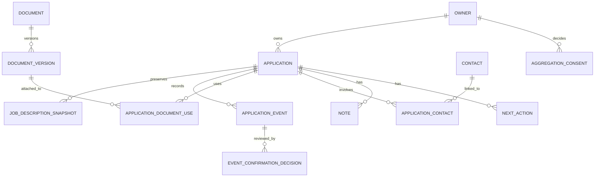

# Wip event-first data model

Status: implemented core manual tracker through Milestone 1C plus later-model requirements
Last updated: 2026-08-05
Database assumption: PostgreSQL

## 1. Goals and invariants

The model must answer both “what is the current state?” and “what happened, according to whom, and when?” Current state is a convenient projection; confirmed history is the durable record.

Core invariants:

1. Every user-owned row has an explicit non-null `owner_id` ownership path. Same-owner composite foreign keys, forced RLS, and owner-scoped repository predicates provide integrity/defense in depth. Runtime grants remain limited to the columns and operations needed by implemented commands.
2. Job-description snapshots are immutable. A recapture inserts a new row.
3. Application-event facts are append-oriented. Corrections supersede earlier events rather than editing their occurrence details.
4. Event occurrence time and record creation time are different fields.
5. Only confirmed events affect current-stage projections and aggregate statistics.
6. Automated status-changing candidates start as `pending`, even at high confidence, during Milestone 3.
7. Free text and direct identifiers never enter the aggregate analytics schema.
8. All timestamps are stored as `timestamptz` in UTC and rendered in the user's timezone.

Use UUID primary keys, database-generated `created_at`, foreign keys, check constraints, and explicit indexes. Use `jsonb` only for versioned event-specific payloads—not as a substitute for stable, queryable columns.

## 2. Relationship overview

Clerk owns credentials and web sessions. `owners` remains the provider-neutral Wip tenant root. A Neon-verified Clerk subject maps uniquely and idempotently to one internal owner UUID; provider subjects are not free-form ownership keys throughout the product schema.

## 3. Core entities

### `owners`

Minimal user settings; not a demographic profile.

| Field | Type | Meaning / constraint |
| --- | --- | --- |
| `id` | `uuid` PK | Internal Wip owner identifier. |
| `auth_provider` | `text` nullable | `clerk` for authenticated owners; null for the isolated fictional seed owner. |
| `auth_subject` | `text` nullable | Clerk's immutable `sub`; unique with provider and independently unique for Clerk when present. |
| `timezone` | `text` | IANA timezone, required after onboarding. |
| `locale` | `text` | Optional presentation locale. |
| `week_starts_on` | `smallint` | Optional UI preference. |
| `created_at` | `timestamptz` | Database-generated. |
| `updated_at` | `timestamptz` | Database-generated on mutation. |

Do not add birthdate, graduation year, race/ethnicity, gender, disability, veteran status, Social Security number, or EEO-response fields. If broad career-stage segmentation is later needed for aggregates, it requires a separate privacy decision and must not be inferred from age or graduation date.

Authenticated web code cannot choose these fields. On first verified access it invokes `wip_provision_owner()` without arguments inside the same transaction that established the server-verified Clerk subject. The function reads that transaction-local subject through `wip_clerk_subject()`, inserts `auth_provider = 'clerk'`/that subject if absent, and returns the stable internal UUID. A retry or concurrent request returns the same owner. Missing transaction identity raises an authorization error rather than creating a row.

### `applications`

The aggregate root and query index for one role at one employer.

| Field | Type | Meaning / constraint |
| --- | --- | --- |
| `id` | `uuid` PK | Application identifier. |
| `owner_id` | `uuid` FK | Owner; indexed with all common list filters. |
| `public_id` | `text` | Stable owner-scoped route identifier. The fictional seed preserves Milestone 1A slugs. |
| `version` | `integer` | Positive optimistic-concurrency version for editable application facts. |
| `create_idempotency_key` | `text` nullable | Owner-unique key for safe create retries. Never supplied as ownership evidence. |
| `create_request_hash` | `text` nullable | SHA-256 fingerprint used to reject reuse of a create key with different input. |
| `last_mutation_id` | `uuid` nullable | Internal replay guard for the last atomic application mutation. |
| `company_name` | `text` | Required, trimmed, user-visible. |
| `role_title` | `text` | Required, trimmed, user-visible. |
| `location_text` | `text` | Optional source/user label; not geocoded in MVP. |
| `workplace` | enum | `remote`, `hybrid`, `on_site`, or `unspecified`. |
| `source_url` | `text` | Optional original job URL. |
| `source_name` | `text` | Optional source label, such as employer site or referral. |
| `requisition_id` | `text` | Optional employer/ATS job identifier; scoped to this application and displayed as entered. |
| `current_stage` | `text` | Cached projection: `saved`, `preparing`, `applied`, `assessment`, `interviewing`, `offer`, `accepted`, `rejected`, or `withdrawn`. |
| `projected_applied_at` | `timestamptz` | Cached occurrence time of the effective confirmed submission event. |
| `last_confirmed_event_at` | `timestamptz` | Cached occurrence time used for sorting. |
| `projected_stage_event_id` | `uuid` nullable | Event currently responsible for the stage projection. |
| `projected_stage_occurred_at` | `timestamptz` nullable | Effective-time ordering key for the projected stage. |
| `projected_stage_created_at` | `timestamptz` nullable | Server-time tie-breaker for equal effective times. |
| `waiting_on` | enum | `candidate`, `employer`, or `none`; updated with the stage projection. |
| `archived_at` | `timestamptz` nullable | Reserved physical field; archive/restore behavior is postponed and not exposed in Milestone 1C. |
| `created_at` | `timestamptz` | Database-generated. |
| `updated_at` | `timestamptz` | Database-generated. |

`current_stage`, `projected_applied_at`, `last_confirmed_event_at`, and `waiting_on` are rebuildable projections. The manual stage command inserts the immutable event and updates projection columns in one identity-establishing Neon transaction. Ordering is by `occurred_at`, then `created_at`, then event ID; therefore a newly recorded backdated event remains in history without incorrectly replacing a later effective stage. Clients never submit projection fields.

Do not initially enforce a unique constraint on company plus role; a person can legitimately reapply. Duplicate detection may warn using normalized company, role, and source URL but must allow override.

### `job_description_snapshots`

An immutable description capture. Database permissions should deny `UPDATE`; deletion occurs only through explicit application/account deletion policy.

| Field | Type | Meaning / constraint |
| --- | --- | --- |
| `id` | `uuid` PK | Snapshot identifier. |
| `application_id` | `uuid` FK | Owning application. |
| `owner_id` | `uuid` FK | Denormalized owner for same-owner constraints, current RLS, and deletion. |
| `captured_at` | `timestamptz` | When the user captured or pasted the content. |
| `capture_source` | `text` | `manual`, `extension`, or future approved import. |
| `source_url` | `text` | URL visible at capture time, if any. |
| `canonical_url` | `text` | Canonical link if safely available. |
| `page_title` | `text` | Source page title. |
| `description_html` | `text` | Sanitized, self-contained description markup; no scripts, handlers, forms, or remote embeds. |
| `description_text` | `text` | Normalized plain text for search, export, and fallback display. |
| `content_sha256` | `text` | Hash of canonicalized captured content for integrity and duplicate detection. |
| `extractor_version` | `text` | Version of manual/capture normalization logic. |
| `provenance` | `text` | Human-readable origin, such as `User-pasted job description`. |
| `capture_metadata` | `jsonb` | Versioned non-sensitive fields such as selected extractor and warnings. |
| `created_at` | `timestamptz` | Ingestion time; normally close to `captured_at`. |

Do not retain a complete page DOM, cookies, scripts, tracking pixels, unrelated page text, or browser history. The manual path accepts plain employer-authored text, normalizes Unicode/newlines and trailing whitespace, creates escaped paragraph/line-break HTML, and hashes the canonical normalized plain text as 64 lowercase hexadecimal SHA-256 characters. The extension path accepts reviewed semantic HTML/text and extraction metadata, then the server independently validates URLs, sanitizes to an allowlist of semantic tags with no attributes, normalizes text, and computes the authoritative SHA-256. Initial capture transactionally inserts one application/event/snapshot. Milestone 2B may instead append that reviewed snapshot to the explicitly displayed owner-scoped duplicate: it inserts a new immutable snapshot and confirmed `job_description.snapshot_attached` event, updates only the application's last-update/version projection, and never rewrites an earlier snapshot. Attachment retries use a request fingerprint/idempotency key; equal current content returns the existing snapshot. Employment type and salary text remain non-authoritative capture metadata, not new application columns. The semantic snapshot definition is confirmed by C-014 in `docs/decisions.md`; screenshots, full-page archives, general snapshot recapture UI, and a full snapshot-history selector remain postponed.

### `application_events`

The chronological fact/proposal stream.

| Field | Type | Meaning / constraint |
| --- | --- | --- |
| `id` | `uuid` PK | Event identifier. |
| `application_id` | `uuid` FK | Owning application. |
| `owner_id` | `uuid` FK | Denormalized owner for same-owner constraints, current RLS, and deletion. |
| `event_type` | `text` | Stable namespaced event type. |
| `event_kind` | enum | Presentation category such as `application`, `assessment`, `interview`, `offer`, or `status`. |
| `title` | `text` | Short user-visible event label. |
| `details` | `text` nullable | Optional event context; not used for arbitrary browser payloads. |
| `occurred_at` | `timestamptz` | When the event is believed to have happened. |
| `source` | `text` | `manual`, `extension`, `email_extraction`, `import`, or `system`. |
| `confidence` | `numeric(4,3)` nullable | `0.000`–`1.000`; null for facts that were not inferred. It is evidence, not authority. |
| `confirmation_state` | `text` | `pending`, `confirmed`, `rejected`, or `not_required`. |
| `payload_version` | `smallint` | Schema version for `payload`. |
| `payload` | `jsonb` | Validated type-specific data; exclude raw email and prohibited attributes. |
| `source_reference_type` | `text` nullable | E.g. `inbound_message`, `extension_capture`, or `user_action`. |
| `source_reference_id` | `uuid` nullable | Internal provenance reference; access-controlled. |
| `supersedes_event_id` | `uuid` nullable FK | Earlier event corrected by this event. |
| `idempotency_key` | `text` nullable | Unique per source/user boundary to prevent duplicate ingestion. |
| `created_by_owner_id` | `uuid` nullable | Owner actor for manual and confirmation actions. |
| `created_at` | `timestamptz` | When Wip recorded the event. |

The event record is immutable after insert, including its initial `confirmation_state`. PostgreSQL update-rejection triggers and the lack of runtime `UPDATE`/`DELETE` grants enforce that rule. Manual events in 1B-3 are created as confirmed. A later automated proposal confirmation appends an `event_confirmation_decision`; the effective confirmation projection uses the latest valid decision rather than rewriting the proposed fact. A rejected proposal remains available for audit but is hidden from the normal confirmed timeline unless the user asks to show rejected suggestions.

Suggested event taxonomy for the first implementation:

| Event type | Stage projection effect when confirmed |
| --- | --- |
| `application.created` | Explicit initial `targetStage` in its validated payload; defaults to `saved` |
| `application.preparation_started` | `preparing` |
| `application.submitted` | `applied`; establishes applied time |
| `employer.confirmation_received` | no stage change; records evidence of submission |
| `employer.contact_received` | no automatic stage change unless payload identifies a specific invited step |
| `screen.invited`, `screen.scheduled`, `screen.completed` | `interviewing` |
| `assessment.requested`, `assessment.submitted`, `assessment.completed` | `assessment`; covers online assessments, HireVues, coding tests, and take-home assignments |
| `interview.invited`, `interview.scheduled`, `interview.completed` | `interviewing` |
| `follow_up.sent` | no stage change |
| `application.rejected` | `rejected` |
| `offer.received` | `offer` |
| `offer.accepted` | `accepted` |
| `offer.declined`, `application.withdrawn` | `withdrawn` by default; exact outcome copy remains in event payload |
| `application.status_corrected` | explicit target stage; must supersede or explain prior event |

Task, note, and document audit events may be added without stage effects. Do not create an event named `application.ghosted` until the product adopts a measurable definition.

### `event_confirmation_decisions`

Append-only audit of proposal review.

| Field | Type | Meaning / constraint |
| --- | --- | --- |
| `id` | `uuid` PK | Decision identifier. |
| `event_id` | `uuid` FK | Reviewed event. |
| `owner_id` | `uuid` FK | Owner and actor. |
| `decision` | `text` | `confirmed` or `rejected`. |
| `reason_code` | `text` nullable | Optional structured rejection/correction reason. |
| `decided_at` | `timestamptz` | Database-generated. |

One active decision per event is expected for Milestone 3. Reconsideration can be modeled later as another decision plus a superseding event, rather than erasing the first decision.

## 4. Document-version metadata

### `documents`

Represents a logical user document.

| Field | Type | Meaning / constraint |
| --- | --- | --- |
| `id` | `uuid` PK | Logical document identifier. |
| `owner_id` | `uuid` FK | Owner. |
| `kind` | `text` | `resume`, `cover_letter`, `portfolio`, or `other`. |
| `title` | `text` | User label, such as “Product resume.” |
| `version` | `integer` | Positive optimistic-concurrency version for edits to logical document metadata. |
| `created_at`, `updated_at` | `timestamptz` | Audit timestamps. |

### `document_versions`

| Field | Type | Meaning / constraint |
| --- | --- | --- |
| `id` | `uuid` PK | Version identifier. |
| `document_id` | `uuid` FK | Logical document. |
| `owner_id` | `uuid` FK | Owner. |
| `version_label` | `text` | User-visible version, e.g. `2026-08 product`. |
| `filename` | `text` nullable | Metadata only; sanitize before display. |
| `content_sha256` | `text` nullable | Allows exact version matching without keeping content. |
| `external_reference` | `text` nullable | Optional user-provided reference; never fetched automatically. |
| `created_at` | `timestamptz` | Version creation time. |

The MVP stores metadata only, not resume or cover-letter contents. Milestone 1C may edit only the logical document's title/kind. Each new file/reference label inserts a new `document_versions` row; the database immutability trigger and absence of runtime update/delete grants prevent revision in place. A future file-storage decision must define encryption, malware scanning, retention, access logging, and export/deletion behavior.

### `application_document_uses`

Many-to-many association preserving exactly which version was used.

| Field | Type | Meaning / constraint |
| --- | --- | --- |
| `id` | `uuid` PK | Association identifier. |
| `application_id` | `uuid` FK | Application. |
| `document_version_id` | `uuid` FK | Immutable version reference. |
| `purpose` | `text` | `prepared`, `submitted`, `shared`, `requested`, or `other`. |
| `used_at` | `timestamptz` nullable | When used/submitted, if known. |
| `created_at` | `timestamptz` | Association creation time. |

Do not repoint an existing use to a different version. Remove the incorrect application use and insert the correct version association; neither operation mutates or deletes the immutable document version.

## 5. Contacts, notes, and actions

### `contacts` and `application_contacts`

`contacts` stores a user-owned person with `display_name`, optional `organization`, `role_title`, `email`, `phone`, `profile_url`, a positive optimistic-concurrency `version`, and timestamps. Every field other than display name is optional. Wip does not enrich contacts automatically in the scoped roadmap.

`application_contacts` links a contact to an application with a `relationship` such as `recruiter`, `referrer`, `interviewer`, `hiring_manager`, or `other`, plus timestamps. The link allows one recruiter to participate in multiple applications without duplicating the contact.

Contact details are personal data. They are excluded from aggregate contribution, product telemetry, and logs.

Milestone 1C permits creating a contact with its first application association, associating an existing owner-scoped contact, editing the contact and relationship, and removing an association. Removing the last association also removes the orphan contact; a contact still used by another application remains. Composite ownership foreign keys and RLS reject cross-owner links.

### `notes`

| Field | Type | Meaning / constraint |
| --- | --- | --- |
| `id` | `uuid` PK | Note identifier. |
| `application_id`, `owner_id` | `uuid` FK | Ownership path. |
| `body` | `text` | User-authored plain text rendered as text, never raw HTML. |
| `version` | `integer` | Positive optimistic-concurrency version for edits. |
| `created_at`, `updated_at` | `timestamptz` | Audit timestamps. |

Notes are operational private content. They are not parsed for hiring statistics or applicant attributes. Deletion can be a hard delete because the application timeline need only record that a note changed, not preserve deleted note text.

### `next_actions`

| Field | Type | Meaning / constraint |
| --- | --- | --- |
| `id` | `uuid` PK | Action identifier. |
| `application_id`, `owner_id` | `uuid` FK | Ownership path. |
| `title` | `text` | Required short task. |
| `kind` | enum | `assessment`, `decision`, `follow_up`, `interview`, `prepare`, or `other`. |
| `details` | `text` nullable | Optional private context. |
| `due_at` | `timestamptz` | Required due time in UTC. |
| `state` | `text` | `open`, `completed`, or `cancelled`. |
| `completed_at` | `timestamptz` nullable | Set by the server when completed. |
| `version` | `integer` | Positive optimistic-concurrency version for edits/rescheduling/completion. |
| `created_at`, `updated_at` | `timestamptz` | Audit timestamps. |

In 1B-3, actions are editable operational records, not application timeline events. Create, reschedule, completion, and removal immediately affect the refreshed Today read model. A later decision may add non-stage audit events, but no such events are implied today.

## 6. Aggregation consent and analytics

### `aggregation_consents`

Consent is an append-only ledger, not a boolean hidden on `owners`.

| Field | Type | Meaning / constraint |
| --- | --- | --- |
| `id` | `uuid` PK | Consent decision identifier. |
| `owner_id` | `uuid` FK | Decision owner. |
| `decision` | `text` | `granted` or `withdrawn`. |
| `policy_version` | `text` | Exact disclosure version shown. |
| `scope` | `jsonb` | Versioned, validated list of contributed measures/dimensions. |
| `decided_at` | `timestamptz` | Database-generated. |
| `withdrawal_reason` | `text` nullable | Optional; never required. |

Current consent is the latest decision. It defaults to not granted when no record exists. Product analytics consent, marketing consent, and Hiring Pulse contribution must be separate.

### Private contribution facts

When Milestone 4 begins, an isolated `analytics_private` schema may contain one row per eligible interval or outcome, derived only from confirmed events belonging to currently opted-in users. A fact can include:

- coarse application-created month or quarter;
- coarse, approved role/employer-size/location dimensions only when sufficiently populated;
- event category or outcome;
- duration in bounded day buckets rather than exact timestamps;
- an opaque contribution key; and
- consent-policy version and derivation version.

It must not include user ID, application ID, name, email, company name, role title, URL, note, contact, document name, raw timestamp, IP address, raw email, or snapshot text. The opaque contribution key is pseudonymous, not anonymous; a separately protected deletion map is retained only so account deletion or consent withdrawal can remove facts and recompute outputs.

Only thresholded output from `analytics_public` is anonymous enough for product display. A cell is suppressed unless it has at least 30 distinct contributors and 100 eligible applications, and each reported metric has at least 30 qualifying observations. Complementary suppression prevents a hidden small cell from being inferred by subtraction. These thresholds are proposed assumptions, not yet confirmed.

### Supporting anonymous timelines without exposing individuals

The flow is one-way and least-privileged:

1. The operational database selects eligible, confirmed events for users with current consent.
2. A restricted job converts exact timestamps to intervals/buckets, removes identifiers and free text, and writes private contribution facts.
3. A second aggregation step groups facts and applies minimum-cohort, metric-denominator, and complementary-suppression rules.
4. The product API can read only released aggregate rows; it cannot query private facts.
5. Consent withdrawal or deletion removes linked private facts, refreshes affected aggregates, and prevents future contribution.

The released data describes participating Wip users, not the total applicant population. No public endpoint exposes row-level facts or small slices.

## 7. Future inbound-email records

Milestone 3 may add two tightly scoped entities:

- `inbound_messages`: provider ID/idempotency key, opaque recipient alias, received time, processing state, transient-object key, deletion deadline, and created/deleted timestamps. Do not copy raw body or attachments into PostgreSQL.
- `extraction_runs`: inbound message ID, parser/model version, structured candidates, confidence, error class, token/cost metadata without content, and timestamps. Status-changing candidates become `application_events` with `source = email_extraction` and `confirmation_state = pending`.

The transient object is deleted immediately after a successful extraction proposal is persisted, unless the user explicitly saves the original. An automatic lifecycle rule is a deletion backstop. A failed message may remain only for the disclosed retry window and is then deleted or requires the user to forward it again.

## 8. Authorization, indexing, and integrity

- Milestone 1B-1 put `owner_id` on every owned relation, used composite `(owner_id, id)` parent keys for same-owner foreign keys, and scoped repository queries.
- Milestone 1B-2 enabled and forced RLS on `owners` and all ten `owner_id` tables. Under C-046, `owners` is visible only when its Clerk subject matches `wip_clerk_subject()` from the current transaction; child policies compare `owner_id` with `wip_current_owner_id()`.
- Milestones 1B-3 and 1C add owner-matching INSERT/UPDATE/DELETE policies only where commands need them. `wip_runtime` is `NOBYPASSRLS`; applications, notes, next actions, logical documents, contacts, and their associations receive only relevant mutable operations; events, snapshots, and document versions receive INSERT but no UPDATE/DELETE. Column-level grants further restrict writable fields. Whole-tracker deletion is exposed only through an owner-derived zero-argument function rather than broad child-table delete grants.
- Clerk verifies sessions before the database boundary. Next.js establishes the verified subject with transaction-local claims, never accepts an arbitrary owner ID, and closes the request-local pool before returning. Browser input cannot choose the claim, runtime role, or connection.
- `DATABASE_URL` is privileged fictional-seed tooling, `DIRECT_DATABASE_URL` is privileged migration tooling, and `NEON_RUNTIME_DATABASE_URL` is normal request-time read/write access through the SQL-created `wip_runtime` role. The runtime role has a separate password, cannot bypass RLS, and has only implemented operation/column grants. Owner/migration credentials are never used for real-user requests or exposed to browsers.
- Add indexes for active application lists, event timelines, due actions, pending confirmations, snapshot versions, document uses, and consent lookup.
- Use database triggers or transactional command handlers to reject cross-user references, snapshot updates, invalid confirmation transitions, and direct projection writes.
- Enforce unique idempotency keys within the relevant source/owner scope.
- Make seed data entirely fictional and associate it only with development/test identities.

### Milestone 1C physical schema and access layer

The checked-in Drizzle schema and SQL migrations implement eleven tables: `owners`, `applications`, `application_events`, `job_description_snapshots`, `documents`, `document_versions`, `application_document_uses`, `contacts`, `application_contacts`, `notes`, and `next_actions`. Application routes use owner-scoped `public_id` values while internal and relationship identifiers are UUIDs. PostgreSQL enums constrain stages and other small taxonomies; common owner/list/timeline/action paths are indexed.

Database triggers reject `UPDATE` on events, job-description snapshots, and document versions. Every owned table has `owner_id`, and every child relationship uses a composite owner/reference foreign key where applicable. The seed's owner and row IDs are deterministic so repeated runs are idempotent; because the seed owner has no auth identity, authenticated policies cannot select it.

Migration `0002_clerk_auth_rls.sql` records the original managed-Neon JWT setup, defines Wip's functions/read policies/grants, creates the Clerk-subject uniqueness constraint, and forces RLS. Migrations `0003` through `0006` add the implemented narrow writes and tracker functions. Migration `0007_server_verified_runtime.sql` adds the SQL-created `wip_runtime` role as `NOLOGIN`/`NOBYPASSRLS`, replaces identity lookup with transaction-local server-verified claims, adds the runtime role to policies, and mirrors only the existing narrow grants. Migration `0008_owner_provisioning_idempotency.sql` makes repeated provisioning tolerate either applicable owner identity uniqueness constraint before selecting the existing owner. Metadata-only migration `0009_previous_bill_hollister.sql` advances Drizzle's snapshot to the policy state already applied by reviewed custom migration `0007`; it executes only `select 1` and makes repeated drift generation return no changes. The runtime password and `LOGIN` activation happen separately so no secret enters migration history. Authenticated operations use request-local Neon WebSocket transactions; seed and migration tooling remains separate.

`event_confirmation_decisions`, aggregation consent, inbox processing, and analytics schemas remain conceptual later work and are deliberately absent. Milestones 2A/2B require no physical schema change: the existing `extension` event/snapshot source values, immutable snapshot columns, owner-scoped application create idempotency, and narrow insert/update grants support both initial capture and append-only attachment. Migration `0009` is metadata-only as described above. Duplicate candidate keys are serialized with transaction-scoped PostgreSQL advisory locks. General snapshot recapture UI/history selection, create-anyway duplicate override, archive/restore, file contents, and Clerk-account deletion remain absent.

## 9. Deletion and export implications

Milestone 1C JSON export is a `wip.tracker.export` envelope with `formatVersion: 1`, generation time, tracker settings, and owner-scoped rows for applications, snapshots, events, logical documents, immutable document versions, application uses, contacts, associations, notes, and actions. It intentionally omits internal owner IDs, Clerk subjects, JWTs, and credentials. Applications CSV is a convenient projection, not a lossless replacement; cells with spreadsheet formula prefixes are neutralized. Both formats are generated and returned directly without persisting an export object.

The individual application-detail command still requires the exact company or role. The Milestone 1C whole-tracker command separately requires the exact phrase `DELETE MY WIP DATA` and calls a zero-argument database function that derives the owner from transaction-local verified identity. The function transactionally deletes that owner's applications, documents, and contacts; cascades remove their owned children; tracker preferences reset to defaults; and the internal owner/Clerk mapping remains so the distinct authentication account can continue. Another owner's rows are unaffected. There is no recovery UI or soft-delete window. Future application/account deletion must additionally remove transient source objects and linked private contribution facts and recompute released aggregates once those systems exist.

Deleted rows may remain in Neon/provider backups until the configured/provider retention window expires; the current repository does not promise immediate physical erasure from backups. Before external beta or production use, record the actual retention setting and ensure a restoration procedure reapplies deletion records before restored data becomes active.
