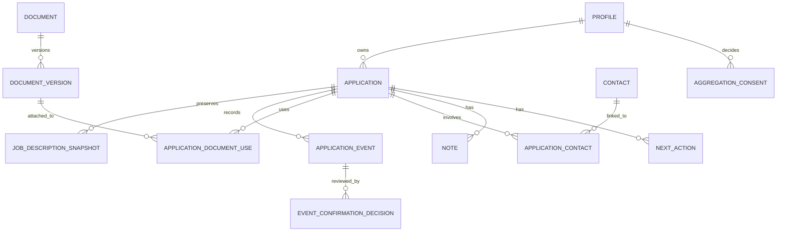

# WIP event-first data model

Status: proposed Milestone 0 model  
Last updated: 2026-08-04  
Database assumption: PostgreSQL

## 1. Goals and invariants

The model must answer both “what is the current state?” and “what happened, according to whom, and when?” Current state is a convenient projection; confirmed history is the durable record.

Core invariants:

1. Every user-owned row has an explicit `user_id` ownership path and is protected by row-level security.
2. Job-description snapshots are immutable. A recapture inserts a new row.
3. Application-event facts are append-oriented. Corrections supersede earlier events rather than editing their occurrence details.
4. Event occurrence time and record creation time are different fields.
5. Only confirmed events affect current-stage projections and aggregate statistics.
6. Automated status-changing candidates start as `pending`, even at high confidence, during Milestone 3.
7. Free text and direct identifiers never enter the aggregate analytics schema.
8. All timestamps are stored as `timestamptz` in UTC and rendered in the user's timezone.

Use UUID primary keys, database-generated `created_at`, foreign keys, check constraints, and explicit indexes. Use `jsonb` only for versioned event-specific payloads—not as a substitute for stable, queryable columns.

## 2. Relationship overview

The authentication provider owns credentials and sessions. `profiles` stores only product settings and references the provider's user identifier.

## 3. Core entities

### `profiles`

Minimal user settings; not a demographic profile.

| Field | Type | Meaning / constraint |
| --- | --- | --- |
| `user_id` | `uuid` PK | References the auth user; cascades on account deletion. |
| `timezone` | `text` | IANA timezone, required after onboarding. |
| `locale` | `text` | Optional presentation locale. |
| `week_starts_on` | `smallint` | Optional UI preference. |
| `created_at` | `timestamptz` | Database-generated. |
| `updated_at` | `timestamptz` | Database-generated on mutation. |

Do not add birthdate, graduation year, race/ethnicity, gender, disability, veteran status, Social Security number, or EEO-response fields. If broad career-stage segmentation is later needed for aggregates, it requires a separate privacy decision and must not be inferred from age or graduation date.

### `applications`

The aggregate root and query index for one role at one employer.

| Field | Type | Meaning / constraint |
| --- | --- | --- |
| `id` | `uuid` PK | Application identifier. |
| `user_id` | `uuid` FK | Owner; indexed with all common list filters. |
| `company_name` | `text` | Required, trimmed, user-visible. |
| `role_title` | `text` | Required, trimmed, user-visible. |
| `location_text` | `text` | Optional source/user label; not geocoded in MVP. |
| `source_url` | `text` | Optional original job URL. |
| `source_name` | `text` | Optional source label, such as employer site or referral. |
| `current_stage` | `text` | Cached projection: `saved`, `preparing`, `applied`, `interviewing`, `offer`, `accepted`, `rejected`, or `withdrawn`. |
| `projected_applied_at` | `timestamptz` | Cached occurrence time of the effective confirmed submission event. |
| `last_confirmed_event_at` | `timestamptz` | Cached occurrence time used for sorting. |
| `active_snapshot_id` | `uuid` nullable FK | Snapshot selected for default display; must belong to this application. |
| `archived_at` | `timestamptz` | Archival is independent from stage. |
| `created_at` | `timestamptz` | Database-generated. |
| `updated_at` | `timestamptz` | Database-generated. |

`current_stage`, `projected_applied_at`, and `last_confirmed_event_at` are rebuildable projections. They must be updated in the same transaction as an event confirmation or by an idempotent projector with a repair command. Clients do not write them directly.

Do not initially enforce a unique constraint on company plus role; a person can legitimately reapply. Duplicate detection may warn using normalized company, role, and source URL but must allow override.

### `job_description_snapshots`

An immutable description capture. Database permissions should deny `UPDATE`; deletion occurs only through explicit application/account deletion policy.

| Field | Type | Meaning / constraint |
| --- | --- | --- |
| `id` | `uuid` PK | Snapshot identifier. |
| `application_id` | `uuid` FK | Owning application. |
| `user_id` | `uuid` FK | Denormalized owner for direct RLS and deletion. |
| `captured_at` | `timestamptz` | When the user captured or pasted the content. |
| `capture_source` | `text` | `manual`, `extension`, or future approved import. |
| `source_url` | `text` | URL visible at capture time, if any. |
| `canonical_url` | `text` | Canonical link if safely available. |
| `page_title` | `text` | Source page title. |
| `description_html` | `text` | Sanitized, self-contained description markup; no scripts, handlers, forms, or remote embeds. |
| `description_text` | `text` | Normalized plain text for search, export, and fallback display. |
| `content_sha256` | `text` | Hash of canonicalized captured content for integrity and duplicate detection. |
| `extractor_version` | `text` | Version of manual/capture normalization logic. |
| `capture_metadata` | `jsonb` | Versioned non-sensitive fields such as selected extractor and warnings. |
| `created_at` | `timestamptz` | Ingestion time; normally close to `captured_at`. |

Do not retain a complete page DOM, cookies, scripts, tracking pixels, unrelated page text, or browser history. The semantic snapshot definition is an assumption pending approval; see `docs/decisions.md`.

### `application_events`

The chronological fact/proposal stream.

| Field | Type | Meaning / constraint |
| --- | --- | --- |
| `id` | `uuid` PK | Event identifier. |
| `application_id` | `uuid` FK | Owning application. |
| `user_id` | `uuid` FK | Denormalized owner for RLS and deletion. |
| `event_type` | `text` | Stable namespaced event type. |
| `occurred_at` | `timestamptz` | When the event is believed to have happened. |
| `source` | `text` | `manual`, `extension`, `email_extraction`, `import`, or `system`. |
| `confidence` | `numeric(4,3)` nullable | `0.000`–`1.000`; null for facts that were not inferred. It is evidence, not authority. |
| `confirmation_state` | `text` | `pending`, `confirmed`, `rejected`, or `not_required`. |
| `payload_version` | `smallint` | Schema version for `payload`. |
| `payload` | `jsonb` | Validated type-specific data; exclude raw email and prohibited attributes. |
| `source_reference_type` | `text` nullable | E.g. `inbound_message`, `extension_capture`, or `user_action`. |
| `source_reference_id` | `uuid` nullable | Internal provenance reference; access-controlled. |
| `supersedes_event_id` | `uuid` nullable FK | Earlier event corrected by this event. |
| `idempotency_key` | `text` nullable | Unique per source/user boundary to prevent duplicate ingestion. |
| `created_by_user_id` | `uuid` nullable | User actor for manual and confirmation actions. |
| `created_at` | `timestamptz` | When WIP recorded the event. |

The event's core fields (`event_type`, `occurred_at`, `source`, payload, provenance, creation time) become immutable after insert. `confirmation_state` is the one controlled state transition; each transition is also written to `event_confirmation_decisions`. A rejected proposal remains available for audit but is hidden from the normal confirmed timeline unless the user asks to show rejected suggestions.

Suggested event taxonomy for the first implementation:

| Event type | Stage projection effect when confirmed |
| --- | --- |
| `application.created` | `saved` |
| `application.preparation_started` | `preparing` |
| `application.submitted` | `applied`; establishes applied time |
| `employer.confirmation_received` | no stage change; records evidence of submission |
| `employer.contact_received` | no automatic stage change unless payload identifies a specific invited step |
| `screen.invited`, `screen.scheduled`, `screen.completed` | `interviewing` |
| `assessment.requested`, `assessment.submitted` | normally retains current active stage |
| `interview.invited`, `interview.scheduled`, `interview.completed` | `interviewing` |
| `follow_up.sent` | no stage change |
| `application.rejected` | `rejected` |
| `offer.received` | `offer` |
| `offer.accepted` | `accepted` |
| `offer.declined`, `application.withdrawn` | `withdrawn` by default; exact outcome copy remains in event payload |
| `application.status_corrected` | explicit target stage; must supersede or explain prior event |

Task, note, and document audit events may be added without stage effects. Do not create an event named `application.ghosted` until the product adopts a measurable definition.

### `event_confirmation_decisions`

Append-only audit of proposal review.

| Field | Type | Meaning / constraint |
| --- | --- | --- |
| `id` | `uuid` PK | Decision identifier. |
| `event_id` | `uuid` FK | Reviewed event. |
| `user_id` | `uuid` FK | Owner and actor. |
| `decision` | `text` | `confirmed` or `rejected`. |
| `reason_code` | `text` nullable | Optional structured rejection/correction reason. |
| `decided_at` | `timestamptz` | Database-generated. |

One active decision per event is expected for Milestone 3. Reconsideration can be modeled later as another decision plus a superseding event, rather than erasing the first decision.

## 4. Document-version metadata

### `documents`

Represents a logical user document.

| Field | Type | Meaning / constraint |
| --- | --- | --- |
| `id` | `uuid` PK | Logical document identifier. |
| `user_id` | `uuid` FK | Owner. |
| `kind` | `text` | `resume`, `cover_letter`, `portfolio`, or `other`. |
| `name` | `text` | User label, such as “Product resume.” |
| `created_at`, `updated_at` | `timestamptz` | Audit timestamps. |

### `document_versions`

| Field | Type | Meaning / constraint |
| --- | --- | --- |
| `id` | `uuid` PK | Version identifier. |
| `document_id` | `uuid` FK | Logical document. |
| `user_id` | `uuid` FK | Owner. |
| `version_label` | `text` | User-visible version, e.g. `2026-08 product`. |
| `original_filename` | `text` nullable | Metadata only; sanitize before display. |
| `content_sha256` | `text` nullable | Allows exact version matching without keeping content. |
| `external_url` | `text` nullable | Optional user-provided reference; never fetched automatically. |
| `storage_object_key` | `text` nullable | Reserved for an explicitly approved future upload feature. |
| `created_at` | `timestamptz` | Version creation time. |

The MVP stores metadata by default, not resume or cover-letter contents. A future file-storage decision must define encryption, malware scanning, retention, access logging, and export/deletion behavior.

### `application_document_uses`

Many-to-many association preserving exactly which version was used.

| Field | Type | Meaning / constraint |
| --- | --- | --- |
| `id` | `uuid` PK | Association identifier. |
| `application_id` | `uuid` FK | Application. |
| `document_version_id` | `uuid` FK | Immutable version reference. |
| `purpose` | `text` | `submitted`, `prepared`, `requested`, or `other`. |
| `used_at` | `timestamptz` nullable | When used/submitted, if known. |
| `created_at` | `timestamptz` | Association creation time. |

Do not repoint an existing use to a different version. Insert a corrected association and record the correction.

## 5. Contacts, notes, and actions

### `contacts` and `application_contacts`

`contacts` stores a user-owned person with `display_name`, optional `organization`, `role_title`, `email`, `phone`, `profile_url`, and timestamps. Every field other than display name is optional. WIP does not enrich contacts automatically in the scoped roadmap.

`application_contacts` links a contact to an application with a `relationship` such as `recruiter`, `referrer`, `interviewer`, `hiring_manager`, or `other`, plus timestamps. The link allows one recruiter to participate in multiple applications without duplicating the contact.

Contact details are personal data. They are excluded from aggregate contribution, product telemetry, and logs.

### `notes`

| Field | Type | Meaning / constraint |
| --- | --- | --- |
| `id` | `uuid` PK | Note identifier. |
| `application_id`, `user_id` | `uuid` FK | Ownership path. |
| `body` | `text` | User-authored Markdown/plain text; render with strict sanitization. |
| `pinned` | `boolean` | Optional presentation flag. |
| `created_at`, `updated_at` | `timestamptz` | Audit timestamps. |

Notes are operational private content. They are not parsed for hiring statistics or applicant attributes. Deletion can be a hard delete because the application timeline need only record that a note changed, not preserve deleted note text.

### `next_actions`

| Field | Type | Meaning / constraint |
| --- | --- | --- |
| `id` | `uuid` PK | Action identifier. |
| `application_id`, `user_id` | `uuid` FK | Ownership path. |
| `title` | `text` | Required short task. |
| `details` | `text` nullable | Optional private context. |
| `due_at` | `timestamptz` nullable | Due time in UTC. |
| `reminder_at` | `timestamptz` nullable | In-app reminder time; external delivery is later. |
| `state` | `text` | `open`, `completed`, or `cancelled`. |
| `completed_at`, `cancelled_at` | `timestamptz` nullable | State audit. |
| `created_at`, `updated_at` | `timestamptz` | Audit timestamps. |

Action creation, completion, rescheduling, and cancellation may append non-stage timeline events so Today changes remain explainable.

## 6. Aggregation consent and analytics

### `aggregation_consents`

Consent is an append-only ledger, not a boolean hidden on `profiles`.

| Field | Type | Meaning / constraint |
| --- | --- | --- |
| `id` | `uuid` PK | Consent decision identifier. |
| `user_id` | `uuid` FK | Decision owner. |
| `decision` | `text` | `granted` or `withdrawn`. |
| `policy_version` | `text` | Exact disclosure version shown. |
| `scope` | `jsonb` | Versioned, validated list of contributed measures/dimensions. |
| `decided_at` | `timestamptz` | Database-generated. |
| `withdrawal_reason` | `text` nullable | Optional; never required. |

Current consent is the latest decision. It defaults to not granted when no record exists. Product analytics consent, marketing consent, and Hiring Pulse contribution must be separate.

### Private contribution facts

When Milestone 4 begins, an isolated `analytics_private` schema may contain one row per eligible interval or outcome, derived only from confirmed events belonging to currently opted-in users. A fact can include:

- coarse application-created month or quarter;
- coarse, approved role/employer-size/location dimensions only when sufficiently populated;
- event category or outcome;
- duration in bounded day buckets rather than exact timestamps;
- an opaque contribution key; and
- consent-policy version and derivation version.

It must not include user ID, application ID, name, email, company name, role title, URL, note, contact, document name, raw timestamp, IP address, raw email, or snapshot text. The opaque contribution key is pseudonymous, not anonymous; a separately protected deletion map is retained only so account deletion or consent withdrawal can remove facts and recompute outputs.

Only thresholded output from `analytics_public` is anonymous enough for product display. A cell is suppressed unless it has at least 30 distinct contributors and 100 eligible applications, and each reported metric has at least 30 qualifying observations. Complementary suppression prevents a hidden small cell from being inferred by subtraction. These thresholds are proposed assumptions, not yet confirmed.

### Supporting anonymous timelines without exposing individuals

The flow is one-way and least-privileged:

1. The operational database selects eligible, confirmed events for users with current consent.
2. A restricted job converts exact timestamps to intervals/buckets, removes identifiers and free text, and writes private contribution facts.
3. A second aggregation step groups facts and applies minimum-cohort, metric-denominator, and complementary-suppression rules.
4. The product API can read only released aggregate rows; it cannot query private facts.
5. Consent withdrawal or deletion removes linked private facts, refreshes affected aggregates, and prevents future contribution.

The released data describes participating WIP users, not the total applicant population. No public endpoint exposes row-level facts or small slices.

## 7. Future inbound-email records

Milestone 3 may add two tightly scoped entities:

- `inbound_messages`: provider ID/idempotency key, opaque recipient alias, received time, processing state, transient-object key, deletion deadline, and created/deleted timestamps. Do not copy raw body or attachments into PostgreSQL.
- `extraction_runs`: inbound message ID, parser/model version, structured candidates, confidence, error class, token/cost metadata without content, and timestamps. Status-changing candidates become `application_events` with `source = email_extraction` and `confirmation_state = pending`.

The transient object is deleted immediately after a successful extraction proposal is persisted, unless the user explicitly saves the original. An automatic lifecycle rule is a deletion backstop. A failed message may remain only for the disclosed retry window and is then deleted or requires the user to forward it again.

## 8. Authorization, indexing, and integrity

- Enable RLS on every exposed table. Ownership policies compare the authenticated user ID with the row's `user_id`; join tables must also validate both referenced objects belong to the same user.
- Keep service-role access server-side and limited to isolated workers. Normal web requests and extension API calls should preserve the user's identity so RLS still applies.
- Add indexes for active application lists, event timelines, due actions, pending confirmations, snapshot versions, document uses, and consent lookup.
- Use database triggers or transactional command handlers to reject cross-user references, snapshot updates, invalid confirmation transitions, and direct projection writes.
- Enforce unique idempotency keys within the relevant source/owner scope.
- Make seed data entirely fictional and associate it only with development/test identities.

## 9. Deletion and export implications

An application export contains application metadata, snapshot HTML/text, confirmed and pending/rejected events with provenance, document-version metadata, contacts linked to that application, notes, and actions. Account export contains all applications plus consent history and settings.

Application deletion cascades through its operational children and requests deletion of transient source objects and linked private contribution facts. Account deletion performs the same operation for all user data and auth identity. Released aggregate cells are then recomputed; already viewed aggregate numbers cannot be recalled, which must be disclosed.

Backups follow the infrastructure provider's retention schedule. Production policy must document the maximum backup persistence and ensure deleted data is not restored into active service without reapplying deletion tombstones.
